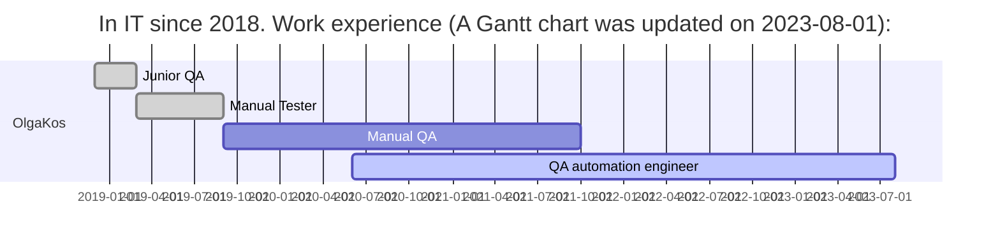

- 👋 Hi, I’m Evgeniy Vasilyev
- 👀 I’m interested in automation testing, AI, ML
- 🌱 I’m currently learning to write auto tests on Python
- 🛠 JUnit, TestNG, Selenium
- 💞️ I’m looking to collaborate on the study of new technologies for me
- 📫 You can reach me by email: eugene.vas25@gmail.com

<!---
eugenevas/eugenevas is a ✨ special ✨ repository because its `README.md` (this file) appears on your GitHub profile.
You can click the Preview link to take a look at your changes.
--->

<h1 align="center">Hi there, I'm <a href="https://github.com/eugene_vas" target="_blank">Evgeniy</a> :vulcan_salute: </h1>
 QA engineer from Sterlitamak. 
 Experience in web testing since 2023
 Automation QA since 2025
 Experience with frontend test automation frameworks like Selenium, Selene, Selenide, PyTest...
 Experience with Java, Python. Base SQL knowledge.

    
<i>Details...</i>

<!-- Additional Work Line section -->
<!-- 
My Work Line
 -->  
    

            
    
<!-- EDU section -->
<!--
## :four_leaf_clover: Образование, курсы

<i>List</i>
 
    
* qa.guru
* software-testing.ru
* Udemy    

-->  

## :computer:  Languages and Tools:
<code></code>
<code></code>
<code></code>
<code></code>
<code></code>

<code></code>
<code></code>
<code></code>
<code></code>
<code></code>
<code></code>

<code></code>
<code></code>
<code></code>

<code></code>
<code></code>
<code></code>
<code></code>
<code></code>
<code></code>
<code></code>
<code></code> 
<code></code> 
<code></code>
      
<!--
<code></code> 
<code></code> 

  

-->

<!--  Contacts section -->
## :anchor: Contact me :) 
<code></code>
<code></code>
<code></code> 

 <!--   
<table valign="top"><tr>   
<td>
<b>Тестовые фреймворки:</b>
 - Selenide (Python) (50%) 
 - Selenium WebDriver (Java) (20%)
</td>   
<td  valign="top">
<b>Средства визуализации результатов тестирования: </b>
 - Allure 
 - Telegram Bot
</td>    
<td> 
<b>Version Control: </b>
 - Git + GitHub (80%) 
</td>
</tr><tr>
<td>
<b>Библиотеки для тестирования:</b>
 - Pytest (Python)
 - Requests (Python)
 - JUnit5 (Java)
 - Rest-Assured
</td>
       
<td>
<b>Системы багтрекинга:</b>
 - Redmine
 - Jira
</td>  
<td>
<b>Удаленный запуск</b>
 - Jenkins 
 - BrowserStack
</td>
</tr><tr>
<td>
<b>Сборщики проектов:</b>
 - Gradle (80%)
 - Maven (20%)
</td>  
<td>
<b>Databases:</b>
 - Microsoft SQL Server
 
</td>    
<td>
<b>Дополнительно:</b>
 - Postman
</td>
</tr></table>
-->

## :black_cat: Pet Projects:

#### Python

<!--

 

## :anchor: Contacts
  
  
--> 

<!--  Widgets section -->
 

#### GitHub stats

<!--

-->
       
------------------
UPD 2025-10-05
